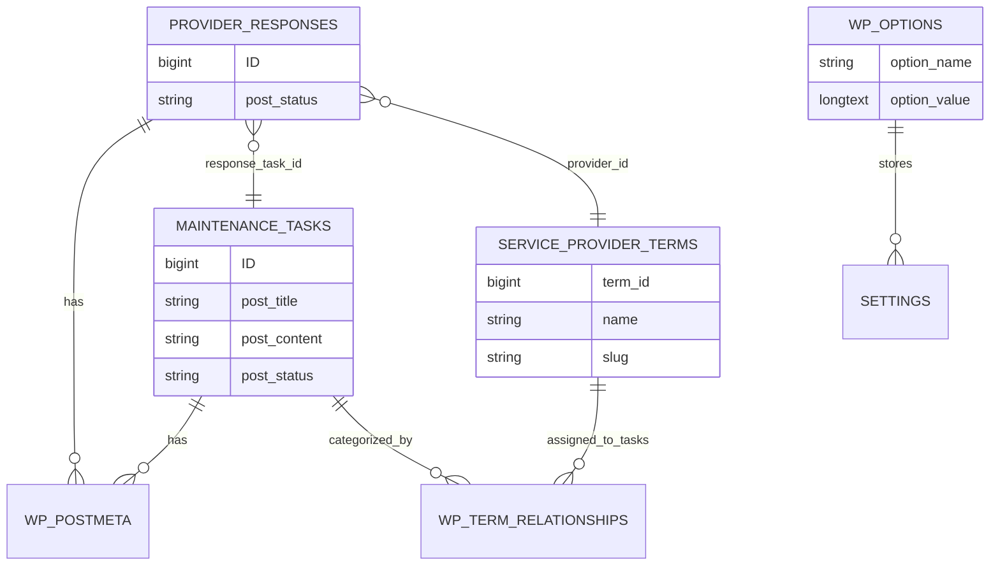

# Upkeepify Data Schema (WordPress Storage)

Upkeepify stores all of its data in **standard WordPress tables** (no custom tables). When this document says “schema”, it means the **logical schema**: custom post types, taxonomies, options, and supported meta fields.

This is intended for:
- plugin developers extending Upkeepify
- site owners migrating Upkeepify between sites
- debugging data corruption/mismatches

## Table of Contents
- [1. WordPress Tables Used](#1-wordpress-tables-used)
- [2. Custom Post Types](#2-custom-post-types)
- [3. Post Meta Fields (Registry)](#3-post-meta-fields-registry)
- [4. Custom Taxonomies](#4-custom-taxonomies)
- [5. Term Meta Fields](#5-term-meta-fields)
- [6. Custom Options](#6-custom-options)
- [7. Meta Boxes (Admin UI)](#7-meta-boxes-admin-ui)
- [8. Relationships & ER Diagram](#8-relationships--er-diagram)
- [9. Validation Rules Summary](#9-validation-rules-summary)
- [10. Migrations Overview](#10-migrations-overview)

---

## 1. WordPress Tables Used

| WordPress table | Used for | Notes |
|---|---|---|
| `wp_posts` | Custom post types (tasks, responses) | “Tasks” are stored as a CPT, not in a custom table |
| `wp_postmeta` | All task/provider-response meta | Meta keys are defined in `includes/constants.php` and documented below |
| `wp_terms`, `wp_term_taxonomy`, `wp_term_relationships` | Taxonomies + term assignments | Categories, types, statuses, providers, units |
| `wp_termmeta` | Service provider term metadata | Phone, email, associated categories |
| `wp_options` | Settings + migration bookkeeping | Settings stored as a single array option |

---

## 2. Custom Post Types

### 2.1 Maintenance Tasks

- **Constant:** `UPKEEPIFY_POST_TYPE_MAINTENANCE_TASKS`
- **Slug:** `maintenance_tasks`
- **Stored in:** `wp_posts`
- **Supported core fields:** title (`post_title`), description/content (`post_content`), status (`post_status`), author (`post_author`), dates
- **Associated taxonomies:**
  - `UPKEEPIFY_TAXONOMY_TASK_CATEGORY`
  - `UPKEEPIFY_TAXONOMY_TASK_TYPE`
  - `UPKEEPIFY_TAXONOMY_TASK_STATUS`
  - `UPKEEPIFY_TAXONOMY_SERVICE_PROVIDER`
  - `UPKEEPIFY_TAXONOMY_UNIT`

**Primary usage locations**
- Admin UI: `includes/custom-post-types.php`
- Frontend: `includes/shortcodes.php` (task form + listings)

### 2.2 Responses

- **Constant:** `UPKEEPIFY_POST_TYPE_RESPONSES`
- **Slug:** `upkeepify_responses`
- **Stored in:** `wp_posts`

This post type is registered for future/extended response workflows.

### 2.3 Provider Responses

- **Constant:** `UPKEEPIFY_POST_TYPE_PROVIDER_RESPONSES`
- **Slug:** `provider_responses`
- **Stored in:** `wp_posts`

Provider response posts are created (draft) when a task is published.

**Primary usage locations**
- Generation: `includes/task-response-handling.php` (`upkeepify_generate_provider_tokens()`)
- Token access form: `includes/shortcodes.php` (`upkeepify_provider_response_form_shortcode()`)

---

## 3. Post Meta Fields (Registry)

> The canonical registry is implemented in: `includes/meta-registry.php`.

### 3.1 Maintenance Task Meta

| Constant | Meta key | Type | Purpose | Example | Used by |
|---|---|---|---|---|---|
| `UPKEEPIFY_META_KEY_NEAREST_UNIT` | `upkeepify_nearest_unit` | integer | Nearest unit number for the task | `12` | `upkeepify_nearest_unit_meta_box_callback()`, `upkeepify_handle_task_form_submission()` |
| `UPKEEPIFY_META_KEY_ROUGH_ESTIMATE` | `upkeepify_rough_estimate` | string | Admin-entered cost estimate (stored as text to allow ranges) | `150-250` | `upkeepify_rough_estimate_meta_box_callback()`, `upkeepify_list_tasks_shortcode()` |
| `UPKEEPIFY_META_KEY_GPS_LATITUDE` | `upkeepify_gps_latitude` | string | Latitude captured on submission | `40.712776` | `upkeepify_handle_task_form_submission()` |
| `UPKEEPIFY_META_KEY_GPS_LONGITUDE` | `upkeepify_gps_longitude` | string | Longitude captured on submission | `-74.005974` | `upkeepify_handle_task_form_submission()` |
| `UPKEEPIFY_META_KEY_TASK_UPDATE_TOKEN` | `_upkeepify_task_update_token` | string | Token for provider-auth updates (if enabled) | `a8B3kLm9pQ2rS7tU1vWx` | `upkeepify_generate_task_update_token()`, `upkeepify_validate_task_update_token()` |
| `UPKEEPIFY_META_KEY_ASSIGNED_SERVICE_PROVIDER` | `assigned_service_provider` | string\|int | Tracks which provider is assigned (implementation may store slug or term_id) | `handyman-heroes` or `55` | `upkeepify_tasks_by_provider_shortcode()` |
| `UPKEEPIFY_META_KEY_DUE_DATE` | `due_date` | string | Optional due date used by calendar view | `2026-01-01` | `upkeepify_task_calendar_shortcode()` |

### 3.2 Provider Response Meta

| Constant | Meta key | Type | Purpose | Example | Used by |
|---|---|---|---|---|---|
| `UPKEEPIFY_META_KEY_RESPONSE_TASK_ID` | `response_task_id` | integer | References the maintenance task post ID | `101` | `upkeepify_generate_provider_tokens()`, `upkeepify_provider_response_form_shortcode()` |
| `UPKEEPIFY_META_KEY_PROVIDER_ID` | `provider_id` | integer | References `service_provider` term_id | `55` | `upkeepify_generate_provider_tokens()` |
| `UPKEEPIFY_META_KEY_RESPONSE_TOKEN` | `response_token` | string | Token that gates access to provider response form | `pR0v1d3rT0k3nAbCdEfGh` | `upkeepify_generate_provider_tokens()`, `upkeepify_provider_response_form_shortcode()` |

### 3.3 Relationships Between Meta Fields

- A **Maintenance Task** may have `assigned_service_provider` to indicate assignment.
- A **Provider Response** references:
  - a **Task** via `response_task_id`
  - a **Service Provider term** via `provider_id`
  - access control via `response_token`

---

## 4. Custom Taxonomies

Taxonomies are registered in `includes/taxonomies.php`.

| Constant | Taxonomy slug | Post type(s) | Hierarchical | Use cases | Default terms |
|---|---|---|---|---|---|
| `UPKEEPIFY_TAXONOMY_TASK_CATEGORY` | `task_category` | `maintenance_tasks` | No | Categorize tasks (e.g., Plumbing) | General Maintenance, Electrical, Plumbing, Landscaping |
| `UPKEEPIFY_TAXONOMY_TASK_TYPE` | `task_type` | `maintenance_tasks` | No | Classify task type (Repair vs Inspection) | Repair, Inspection, Installation |
| `UPKEEPIFY_TAXONOMY_TASK_STATUS` | `task_status` | `maintenance_tasks` | No | Workflow status tracking | Open, In Progress, Completed, On Hold |
| `UPKEEPIFY_TAXONOMY_SERVICE_PROVIDER` | `service_provider` | `maintenance_tasks` | No | Service provider directory + task filtering | (Sample providers inserted; site-specific) |
| `UPKEEPIFY_TAXONOMY_UNIT` | `unit` | `maintenance_tasks` | No | Optional unit term tagging | (none) |

---

## 5. Term Meta Fields

Term meta is primarily used for **Service Providers**.

| Constant | Term meta key | Stored on taxonomy | Type | Purpose | Example | Used by |
|---|---|---|---|---|---|---|
| `UPKEEPIFY_TERM_META_PROVIDER_PHONE` | `provider_phone` | `service_provider` | string | Provider phone number | `+1 555-123-4567` | provider term add/edit form + notifications (future) |
| `UPKEEPIFY_TERM_META_PROVIDER_EMAIL` | `provider_email` | `service_provider` | string | Provider email | `provider@example.com` | provider term add/edit form |
| `UPKEEPIFY_TERM_META_ASSOCIATED_CATEGORIES` | `associated_task_categories` | `service_provider` | array<int> | Links provider to categories (term IDs from `task_category`) | `[12, 13]` | provider term add/edit form |

Storage format
- Term meta arrays are stored by WordPress via PHP serialization.

---

## 6. Custom Options

Options are stored in `wp_options`.

### 6.1 Plugin Settings

- **Constant:** `UPKEEPIFY_OPTION_SETTINGS`
- **Option name:** `upkeepify_settings`
- **Type:** associative array
- **Defaults:** see `upkeepify_get_default_settings()` in `includes/migrations.php`

| Setting key constant | Key | Type | Default | Purpose | Used in |
|---|---|---:|---:|---|---|
| `UPKEEPIFY_SETTING_SMTP_OPTION` | `upkeepify_smtp_option` | bool/int | `0` | Use built-in SMTP | `includes/settings.php` |
| `UPKEEPIFY_SETTING_SMTP_HOST` | `upkeepify_smtp_host` | string | `''` | SMTP host | `includes/settings.php` |
| `UPKEEPIFY_SETTING_NOTIFY_OPTION` | `upkeepify_notify_option` | bool/int | `1` | Notify on status change | `includes/utility-functions.php` |
| `UPKEEPIFY_SETTING_PROVIDER_DELETE_TASK` | `upkeepify_provider_delete_task` | bool/int | `0` | Allow providers to delete tasks | `includes/settings.php` |
| `UPKEEPIFY_SETTING_PUBLIC_TASK_LOGGING` | `upkeepify_public_task_logging` | bool/int | `0` | Allow public logging | `includes/settings.php` |
| `UPKEEPIFY_SETTING_OVERRIDE_EMAIL` | `upkeepify_override_email` | string | `''` | Override email for notifications | `includes/utility-functions.php`, `includes/settings.php` |
| `UPKEEPIFY_SETTING_ENABLE_TOKEN_UPDATE` | `upkeepify_enable_token_update` | bool/int | `0` | Enable provider token update flows | `includes/settings.php`, `includes/utility-functions.php` |
| `UPKEEPIFY_SETTING_NUMBER_OF_UNITS` | `upkeepify_number_of_units` | int | `10` | Number of units (drives UI selectors) | `includes/custom-post-types.php`, `includes/shortcodes.php` |
| `UPKEEPIFY_SETTING_CURRENCY` | `upkeepify_currency` | string | `$` | Currency symbol for estimates | `includes/shortcodes.php` |
| `UPKEEPIFY_SETTING_ENABLE_THANK_YOU_PAGE` | `upkeepify_enable_thank_you_page` | bool/int | `0` | Enable custom thank-you redirect | `includes/settings.php` |
| `UPKEEPIFY_SETTING_THANK_YOU_PAGE_URL` | `upkeepify_thank_you_page_url` | string | `''` | Thank-you page URL | `includes/settings.php` |

### 6.2 Sample Data Marker

- **Constant:** `UPKEEPIFY_OPTION_SAMPLE_DATA_INSERTED`
- **Option name:** `upkeepify_sample_data_inserted`
- **Type:** integer timestamp
- **Purpose:** prevent duplicate sample-data insertion
- **Used in:** `includes/sample-data.php`, `upkeepify.php`

### 6.3 Notifications

- **Constant:** `UPKEEPIFY_OPTION_NOTIFICATIONS`
- **Option name:** `upkeepify_notifications`
- **Type:** array (implementation-defined)
- **Used in:** `includes/notification-system.php`

### 6.4 Migration / Version Tracking

| Constant | Option name | Type | Purpose |
|---|---|---|---|
| `UPKEEPIFY_OPTION_DB_VERSION` | `upkeepify_db_version` | int | Current stored schema version |
| `UPKEEPIFY_OPTION_MIGRATION_HISTORY` | `upkeepify_migration_history` | array | List of migration runs (timestamp/from/to/status/message) |
| `UPKEEPIFY_OPTION_MIGRATION_LOG` | `upkeepify_migration_log` | array<string> | Rolling debug log |
| `UPKEEPIFY_OPTION_BACKUP_HISTORY` | `upkeepify_backup_history` | array | Rolling backup file list |

---

## 7. Meta Boxes (Admin UI)

Meta boxes are defined in `includes/custom-post-types.php`.

### 7.1 Nearest Unit Meta Box

- **Meta box ID constant:** `UPKEEPIFY_META_BOX_NEAREST_UNIT`
- **Meta box ID:** `upkeepify_nearest_unit`
- **Shown on:** Maintenance Tasks (`UPKEEPIFY_POST_TYPE_MAINTENANCE_TASKS`)
- **Context:** `side`
- **Callback:** `upkeepify_nearest_unit_meta_box_callback()`
- **Saves meta key:** `UPKEEPIFY_META_KEY_NEAREST_UNIT`
- **Validation:** integer >= 1

### 7.2 Rough Estimate Meta Box

- **Meta box ID constant:** `UPKEEPIFY_META_BOX_ROUGH_ESTIMATE`
- **Meta box ID:** `upkeepify_rough_estimate`
- **Shown on:** Maintenance Tasks
- **Context:** `side`
- **Callback:** `upkeepify_rough_estimate_meta_box_callback()`
- **Saves meta key:** `UPKEEPIFY_META_KEY_ROUGH_ESTIMATE`
- **Validation:** string <= 50 chars

---

## 8. Relationships & ER Diagram

### 8.1 High-level relationships

- **Maintenance Task** ↔ **Category/Type/Status/Provider/Unit** via WordPress term relationships.
- **Provider Response** → **Maintenance Task** via `response_task_id`.
- **Provider Response** → **Service Provider** via `provider_id`.

### 8.2 ER Diagram (Mermaid)

---

## 9. Validation Rules Summary

Validation functions live in `includes/data-validation.php`.

### 9.1 Task validation
- Title: required, <= 200 chars
- Description: required
- `upkeepify_nearest_unit`: integer >= 1
- `upkeepify_gps_latitude`: numeric string in [-90, 90]
- `upkeepify_gps_longitude`: numeric string in [-180, 180]
- `upkeepify_rough_estimate`: string <= 50 chars
- `due_date`: must be parseable by `strtotime()` (optional)

### 9.2 Provider validation
- Email must be valid if provided
- Phone max length 50
- Associated categories: array of positive integers

### 9.3 Settings validation
- Booleans stored as `0/1`
- `upkeepify_number_of_units`: int >= 0
- `upkeepify_currency`: string <= 8

---

## 10. Migrations Overview

Upkeepify tracks its schema version using:
- `UPKEEPIFY_DB_VERSION` (code constant)
- `UPKEEPIFY_OPTION_DB_VERSION` (stored value)

On every admin page load, Upkeepify warns if migrations are pending and provides a **Run Migrations** button.

See: **`docs/MIGRATIONS.md`** for the migration template and authoring rules.
